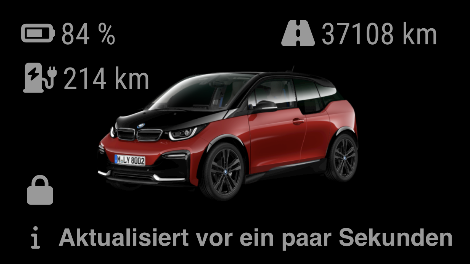

# MMM-CarDisplay

MagicMirror² module for displaying vehicle data from a JSON/REST endpoint, for
example an endpoint provided by Home Assistant.

The module displays:

- a configurable vehicle image;
- lock and charging status;
- battery state of charge for electric vehicles;
- electric and fuel range;
- total mileage; and
- the relative time of the last update.

The module does not communicate with BMW or another vehicle manufacturer
directly. It performs an HTTP `GET` request to `requestUrl`, sends the optional
`hassAPIKey` as a Bearer token, and renders the JSON object returned by that
endpoint. This also makes it possible to configure one module instance per
vehicle or per data source.

## Requirements

- A working MagicMirror² installation.
- Node.js 18 or newer, because the node helper uses the built-in `fetch` API.
- An HTTP endpoint reachable from the MagicMirror host that returns the data
  format described below.

No Python installation, npm package installation, MyBMW account, VIN, or
hCaptcha token is required by this module.

## Installation

Clone this repository into the MagicMirror modules directory:

    cd ~/MagicMirror/modules
    git clone https://github.com/Jargendas/MMM-CarDisplay.git

The module has no additional npm dependencies, so `npm install` is not needed.

## Configuration

Add the module to the `modules` array in the MagicMirror `config/config.js`:

    {
        module: "MMM-CarDisplay",
        position: "top_right",
        config: {
            requestUrl: "http://homeassistant.local:8123/api/car-display",
            hassAPIKey: "YOUR_LONG_LIVED_ACCESS_TOKEN",
            artwork: "car.png",
            refresh: 5
        }
    },

`requestUrl` must return one flat JSON object using the field names listed in
[Data format](#data-format). The module does not convert the nested response of
Home Assistant's standard `/api/states/...` endpoint into this format. If the
endpoint requires authentication, use a Home Assistant long-lived access token
as `hassAPIKey`. Do not commit the token to a public repository.

The value of `artwork` is a path relative to the module directory. For example,
`"car.png"` refers to `MagicMirror/modules/MMM-CarDisplay/car.png`.

## Data format

The endpoint must respond to a `GET` request with a JSON object. Distance values
are expected in kilometres when `useUSUnits` is `false`:

    {
        "mileage": 12345,
        "electric_range": 320,
        "fuel_range": 0,
        "state_of_charge": 80,
        "connector_status": true,
        "door_lock": false,
        "update_time": "2026-08-23T12:00:00Z"
    }

All response fields are optional; `requestUrl` is required in the module
configuration. The module uses the following fields when they are present:

| Field | Type | Description |
| --- | --- | --- |
| `mileage` | number | Total distance driven. |
| `electric_range` | number | Remaining electric range. When `showElectricPercentage` is enabled, its presence also enables the battery percentage row. |
| `fuel_range` | number | Remaining fuel range. |
| `state_of_charge` | number | Battery charge percentage, displayed together with a battery icon. |
| `connector_status` | boolean | Shows a charging icon when `true`. |
| `door_lock` | boolean | `false` displays a locked icon; `true` displays an unlocked icon. |
| `update_time` | date/time string | Timestamp parsed by Moment.js and displayed relative to the current time. |
| `error` | string | Displays the error text instead of the vehicle data. |

Use the exact snake_case field names shown above. Fields that are not returned
are omitted from the corresponding part of the display. In particular, omit
`electric_range` for a vehicle without electric data if the battery row should
not be displayed.

## Module configuration

| Option | Description | Default |
| --- | --- | --- |
| `requestUrl` | URL queried by the node helper. Required. | — |
| `artwork` | Image filename or path relative to the module directory. | `""` |
| `refresh` | Data refresh interval in minutes. | `1` |
| `vehicleOpacity` | Opacity of the vehicle image, from `0` to `1`. | `0.75` |
| `useUSUnits` | Uses miles (`mi`) instead of kilometres (`km`) for distance display. | `false` |
| `showMileage` | Shows the total mileage when `mileage` is available. | `true` |
| `showElectricPercentage` | Shows the battery percentage when `electric_range` and `state_of_charge` are available. | `true` |
| `showElectricRange` | Shows the electric range when `electric_range` is available. | `true` |
| `showFuelRange` | Shows the fuel range when `fuel_range` is available. | `true` |
| `showLastUpdated` | Shows the relative last-update text. | `true` |
| `lastUpdatedText` | Text placed before the relative update time, e.g. `"zuletzt aktualisiert"`. | `"last updated"` |
| `hassAPIKey` | Optional token sent as `Authorization: Bearer <token>`. | `""` |

The module requests data once when it starts and then at the configured
`refresh` interval. The relative last-update text is refreshed every 30
seconds without making another HTTP request.

## History and origin

The first version of this module used the existing `MMM-MyBMW` module as a
template for its MagicMirror structure and display. `MMM-MyBMW` is itself
heavily based on [MMM-BMWConnected](https://github.com/jannekalliola/MMM-BMWConnected)
by [Howard Durdle](https://github.com/hdurdle) and
[Janne Kalliola](https://github.com/jannekalliola). The original project used
[`bimmer_connected`](https://github.com/bimmerconnected/bimmer_connected) to
query the MyBMW API.

`MMM-CarDisplay` is a separate, simplified continuation of that idea. The
manufacturer-specific API integration, Python backend, credentials, VIN,
region selection, session storage, and hCaptcha handling were removed. The
current module only consumes the generic JSON endpoint described above, so it
can also be used with data assembled by Home Assistant or another service.

## Changelog

**2025-10-24** Initial `MMM-CarDisplay` version with a generic REST/JSON data
source.

**2026-04-06** Improved multi-instance behaviour and rounded displayed vehicle
values for a cleaner presentation.
